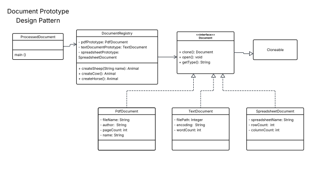

Document Prototype Implementation

Problem Statement
    The objective is to implement a Document Management System using the Prototype Design Pattern based on a specific UML Diagram. The system must efficiently create document objects by cloning pre-initialized prototypes rather than instantiating new ones from scratch each time. The implementation must strictly produce the following console output, ensuring that the prototype initialization occurs exactly once per type:

Expected Output:
~~~~~~~~~~~~~~~~~~~~~~~~~~~~~~~~~~~~~~~~~~~~~~~~~~~~~~~~~~~~~~~~~~~~~~~~~~
Creating a PDF Document prototype.
Creating a Text Document prototype.
Creating a Spreadsheet Document prototype.
Opening PDF Document: annual_report_2024.pdf by Acme Corp (150 pages)
Type: PDF, File: annual_report_2024.pdf, Author: Acme Corp, Pages: 150
Opening Text Document: meeting_notes.txt with encoding: UTF-8 (250 words)
Type: Text, Path: meeting_notes.txt, Encoding: UTF-8, Words: 250
Opening Spreadsheet Document: sales_data_q1.xlsx (1000 rows, 20 columns)
Type: Spreadsheet, Name: sales_data_q1.xlsx, Rows: 1000, Columns: 20
Opening PDF Document: summary_report.pdf by Acme Corp (30 pages)
~~~~~~~~~~~~~~~~~~~~~~~~~~~~~~~~~~~~~~~~~~~~~~~~~~~~~~~~~~~~~~~~~~~~~~~~~~

Solution Approach
    Prototype Pattern: Concrete document classes (Pdf, Text, Spreadsheet) implement a clone() method using super.clone(). This allows the creation of new objects without re-executing the constructor logic.

    Registry Management: The DocumentRegistry class maintains private, final instances of each document type. These are initialized immediately upon registry creation to output the "Creating..." messages.

    Encapsulation: Document properties are updated post-cloning via a setProperties method, allowing the cloned document to represent specific file data while retaining the base prototype structure.